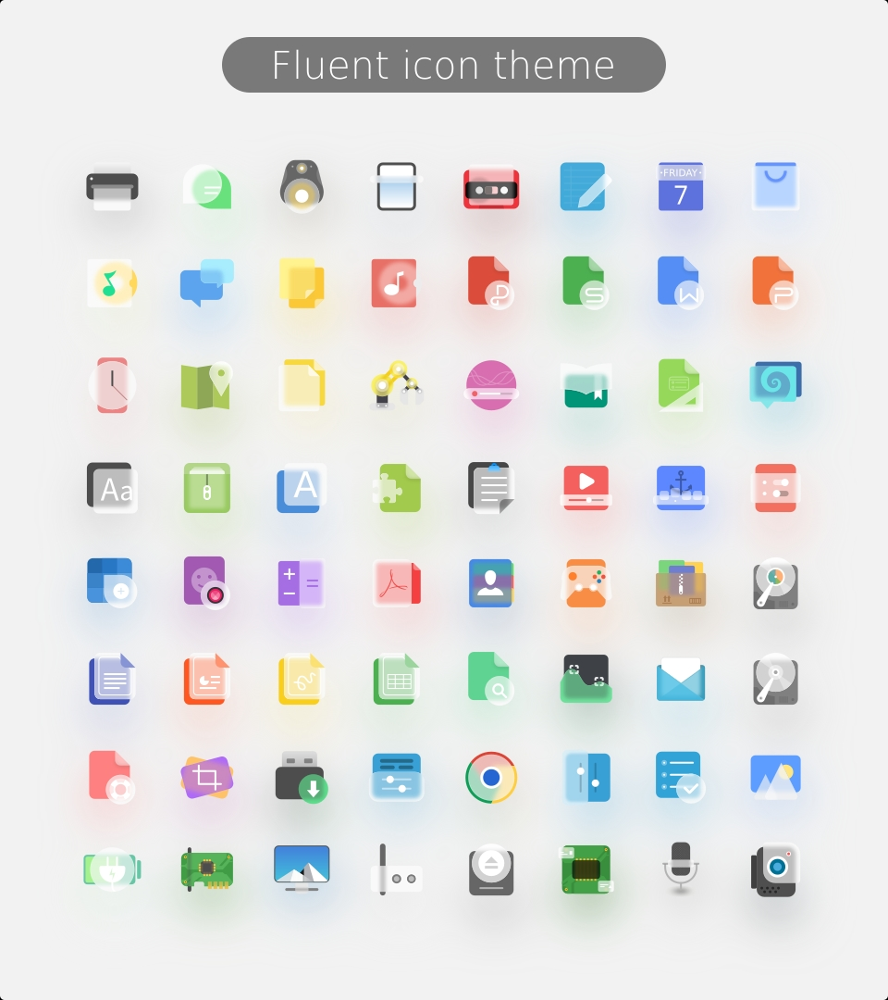
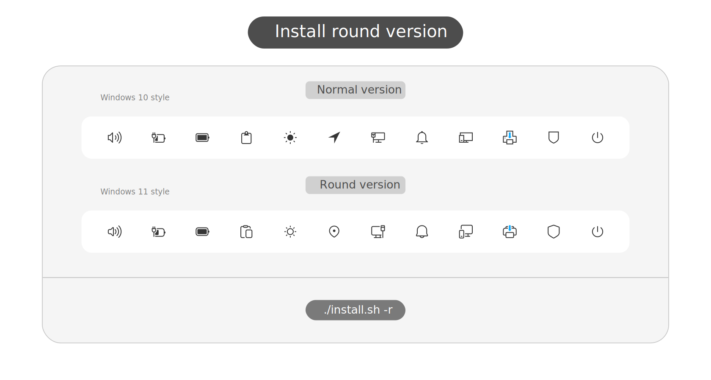

## Installation

Usage:  `./install.sh`  **[OPTIONS...]** **[COLOR VARIANTS...]**

|  OPTIONS:   |                                                                               |
|:------------|:------------------------------------------------------------------------------|
| -a, --all   | Install all color versions                                                    |
| -d, --dest  | Specify theme destination directory (**Default:** _$HOME/.local/share/icons_) |
| -n, --name  | Specify theme name (**Default:** _Fluent_)                                    |
| -r, --round | Install rounded version                                                       |
| -h, --help  | Show this help                                                                |

|  COLOR VARIANTS |                                       |
|:----------------|:--------------------------------------|
| standard        | Standard color folder version         |
| green           | Green color folder version            |
| grey            | Grey color folder version             |
| orange          | Orange color folder version           |
| pink            | Pink color folder version             |
| purple          | Purple color folder version           |
| red             | Red color folder version              |
| yellow          | Yellow color folder version           |

By default, only **the standard one** is selected.

## Donate

If you like my project, you can buy me a coffee:

