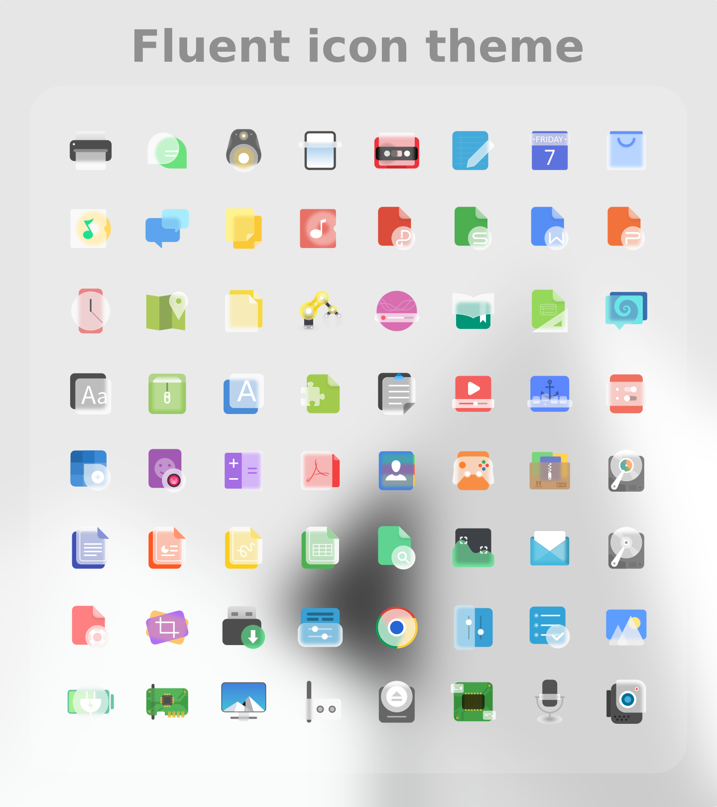

## Fluent Icon Theme
A Fluent design icon theme

## Installation

Usage:  `./install.sh`  **[OPTIONS...]** **[COLOR VARIANTS...]**

|  OPTIONS: |                                                                               |
|:----------|:------------------------------------------------------------------------------|
| -a        | Install all color versions                                                    |
| -d        | Specify theme destination directory (**Default:** _$HOME/.local/share/icons_) |
| -n        | Specify theme name (**Default:** _Fluent_)                                    |
| -h        | Show this help                                                                |

|  COLOR VARIANTS |                                       |
|:----------------|:--------------------------------------|
| standard        | Standard color folder version         |
| green           | Green color folder version            |
| grey            | Grey color folder version             |
| orange          | Orange color folder version           |
| pink            | Pink color folder version             |
| purple          | Purple color folder version           |
| red             | Red color folder version              |
| yellow          | yellow color folder version           |

By default, only **the standard one** is selected.
